# 개요

간단히 메모 카테고라이징 + 맞춤형 필터링을 제공하는 피그마 메모 플러그인

문서가 구조화된 형식 위에서 일어날 때  
구조 기반으로 메모를 보는 것이 실제로 편리한 지 검증하기 위한 프로토타입

[가설 pdf](./가설%20정의.pdf)  
[가설 문서](https://publish.obsidian.md/bangjunwoo/Project/figma-memo/202410100303)

## 주요 기능

- 섹션 추적: 현재 유저가 선택한 노드가 위치한 섹션이랑 페이지 기반으로 주소를 흭득
- 메모: 전체 메모에서 추적된 섹션 링크에 해당하는 메모를 제공
- 카테고리: 업무 플로우 상 공유되야할 것
- 섹션: 기능 명세서 상 경로 정의
- 링크: 링크와 컴포넌트간의 연결
- 컴포넌트 메모: 뷰에 대한 설명
- 필터: 보여질 메모에 대한 포커스 수준 결정

## 사용되는 컨벤션 예시

- 카테고리 상에서 Plan > Design > Develop > Deploy > Test , Sprint(pin) 은 업무 플로우를 나타내기 위함
  - 카테고리가 더 고정적이기 때문에 상단 카테고리가 카테고리로 구성되었음
- 섹션은 `메모/메모 추가 모달` 처럼 기능 명세서 상의 구조도를 나타내기 위해 정의되었음
- 같은 섹션 구조는 서로 공유됨 페이지 위치에 관계 없이
  - 하위 섹션도 같이 조회되서 화면에 보여짐

## 목적

페이지 기반, 또는 페이지와 섹션 이름을 기반으로 페이지에 등록된 메모만 보는 인터페이스

요구사항 키워드를 기반으로 봐야할 메모를 포커싱해서 볼 수 있게 하는 것이 목적

- 문서가 없는 것을 파악한 사람이 문서를 추가하며 작업할 수 있음
- 시스템이 구조를 강제하기에 편하기 위해 규칙을 지키도록 유도하는 효과
- 피그마를 중심으로 기획, 디자인 , 개발 , QA, 배포 현황 파악 등을 연결하는 효과
- 피그마 내 요소들을 메모로 레핑해서 외부에서 관리할 수 있도록 등록 가능

### 핵심 기능

1.  경로 기반의 메모 작성 가능
2.  메모에 특정 컴포넌트로 가는 숏 컷 저장 기능
3.  메모 카테고리 생성 기능
4.  외부 링크 추가 기능
    - 외부 링크가 식별 대상일 경우 아이콘 변경 ( notion, fimga , github)
5.  하나의 파일을 기반으로 동시 접속 수정 가능
6.  다른 사람의 메모를 수정할 수 없음
7.  포커싱 옵션 선택 가능 ( 페이지 , 섹션 ) ( all은 추후 추가 예정 )

### 보이지 않는 기능

1. 작성 시간, 수정 시간 기록
2. 작성자 기록 됨
3. 유저 닉네임 설정
4. 설명 추가 가능 ( ui에는 추가 안된 기능 )

# 설치 방법

```
npm i
npm run build
```

피그마 플러그인에서 develop 에 manifast.json 추가

# 사용 방법

플러그인 등록 후 사용
파일에 저장되는 내용은 피그마를 사용하는 전체 유저가 공유함

## 사용 예시

로컬라이제이션을 위해 찾고자하는 text 컴포넌트를 등록해서 사용

## 기능 설명

### 포커싱 조절하기

페이지를 이동하거나 선택된 노드가 바뀌거나 선택 해제 할 때  
선택된 현재 섹션이 변경되고 현재 선택된 경로가 현재 섹션: ~ 으로 표시 됨

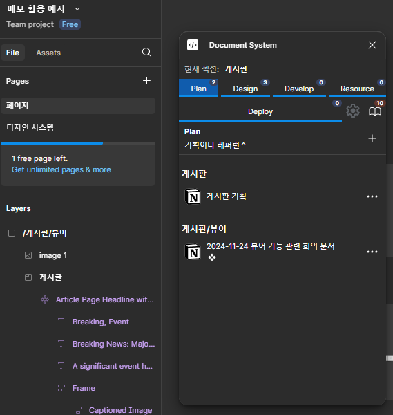

## 전체 메모 조회하기

책 아이콘을 누르면 포커싱 위치 상관 없이 전체 메모를 조회할 수 있다  
상단 뱃지는 해당 카테고리의 전체 메모 갯수를 나타냄

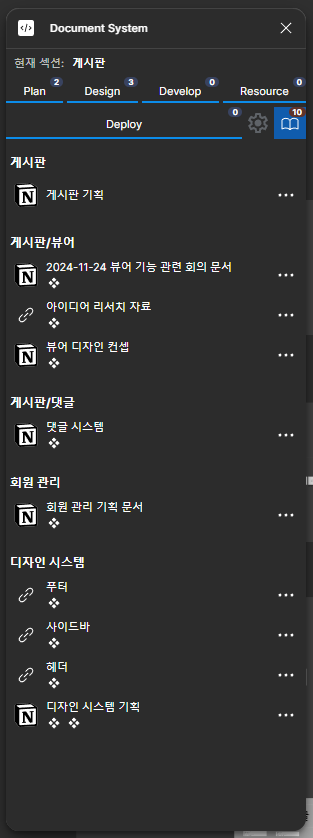

## 포커싱 메모 조회

선택 대상을 기준으로 메모가 조회된다  
게시판에는 2/3개의 메모가 있고  
게시판/뷰어에는 1/1개의 메모가 있는 것을 알 수 있다

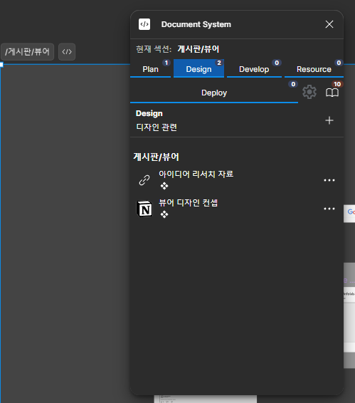

## 경로 생성 규칙

페이지명/...섹션명 순으로 경로가 생성되고  
섹션명은 여러번 중첩할 수 있어서 페이지명/A/B 처럼 생성된다  
이름 앞에 /를 붙였을 경우 해당 섹션을 루트로 판단한다

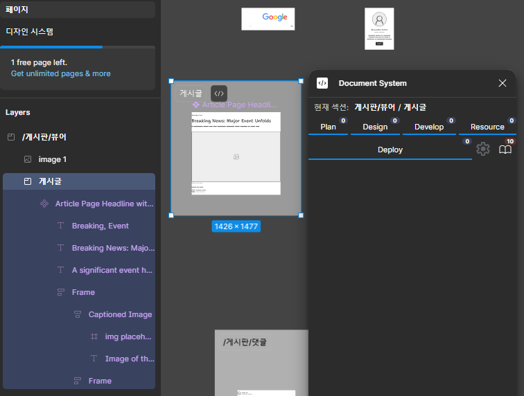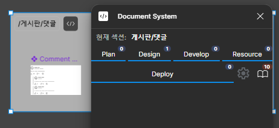

## 포커싱 기준 조절

포커싱 기준을 페이지로 설정하면 페이지 기준으로 경로가 생성되고  
섹션으로 설정하면 섹션 기준으로 경로가 생성된다  
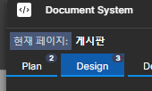

## 노드 포커스 숏 컷

메모할 때 추가한 참조 컴포넌트 추가는 컴포넌트 아이콘을 추가하고  
이 아이콘을 누르면 해당 위치로 이동한다

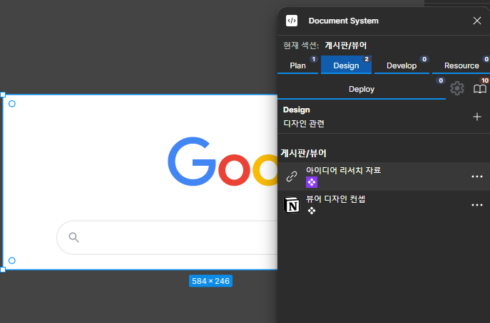

## 링크 열기

누르면 링크가 열린다  
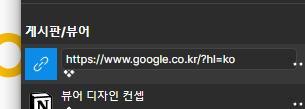

## 설정 창 기능

설정창에서는 카테고리를 추가하거나  
페이지나 섹션에 대해 별칭을 부여할 수 있다

보이는 경로 명과 실제 섹션 명이 다를 때 사용할 수 있다

이 기능을 적용햇기 때문에 예시에서  
페이지 이름이 페이지 인데 게시판으로 인식되는 것을 볼 수 있다


## dev 모드에서 켜지고 써진다

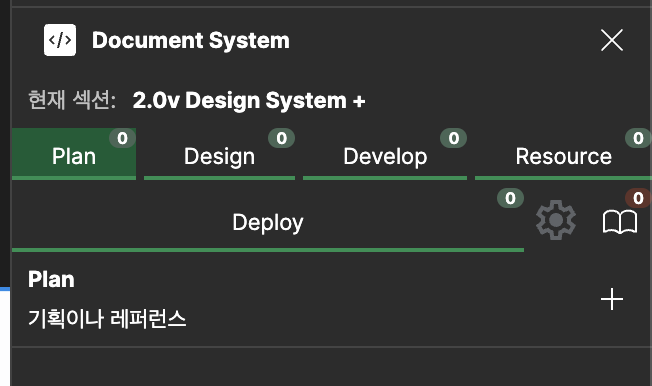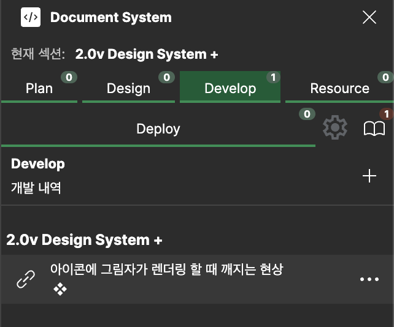

## 시나리오 예시

[WBS](https://code-library.notion.site/14714d434d93804b8027e446be33370d?pvs=4) 문서와 [피그마 파일](https://www.figma.com/design/THAqaplHYAwKuI8jaN8XUQ/%EB%A9%94%EB%AA%A8-%ED%99%9C%EC%9A%A9-%EC%98%88%EC%8B%9C?node-id=0-1&t=Miq49t7T7mJakCed-1)이 있는 것을 가정함

### 메모 작성하기

1. 기본 화면에서 탭을 선택하면 아래에 + 버튼이 나타남
   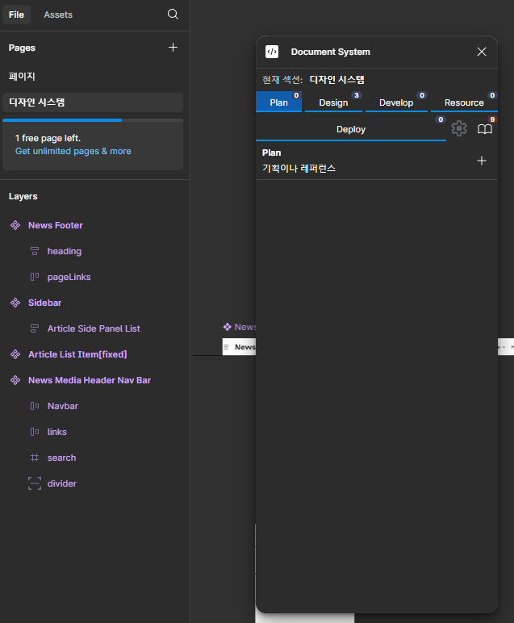

2. 작성하고자하는 내용 추가

작업 중인 화면을 기준으로 경로를 가져오고
제목, 설명 , 추가하고자하는 숏 컷을 추가

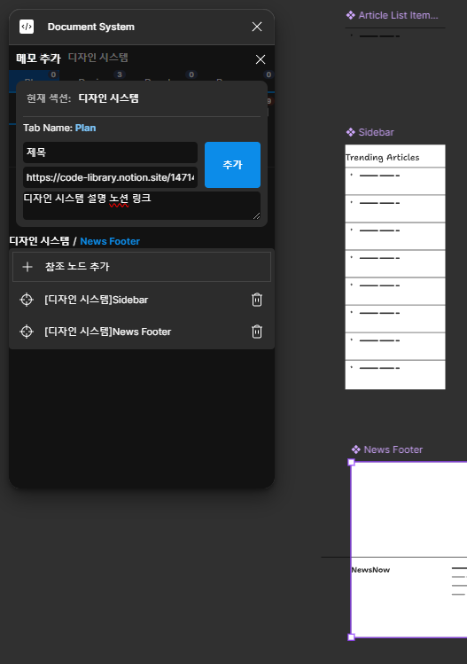

3. 결과

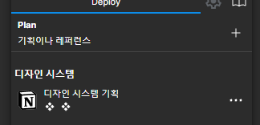

- 디자인 시스템 => 페이지명
- 디자인 시스템 기획 => 제목
- 아래 컴포넌트 아이콘은 숏 컷
- 링크가 노션 링크여서 노션 아이콘 부여

### 수정해서 이동하기

plan 카테고리에 잘못 작성한 메모를 develop으로 이동하고 섹션 경로도 수정하는 방법

수정 메뉴를 연 상태애서 섹션 이동하고 카테고리 수정하고 수정 버튼 누를 시 섹션 경로 , 카테고리 수정 완료 됨

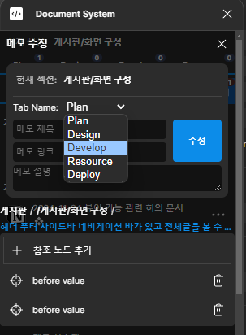

#### 번외

수정 완료하거나 추가 할 때 선택된 상태였던 노드가 첫번째 참조 노드로 저장됨  
참조 노드를 눌러서 이전에 저장했던 위치를 찾아갈 수 있다  
(노드는 중복 저장되지 않음)
